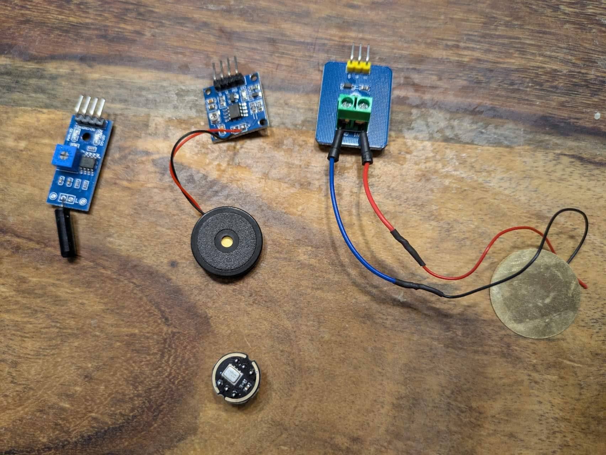
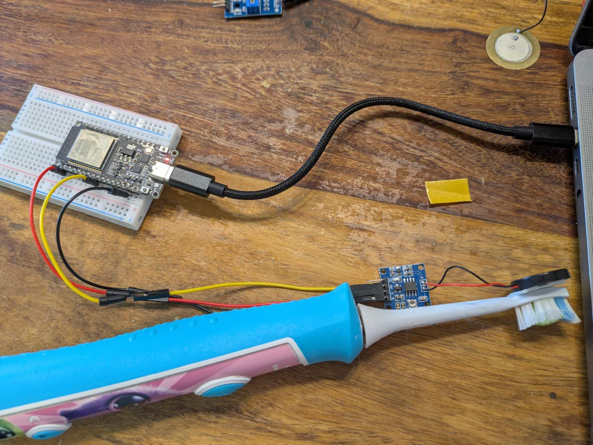

Intro

ZahniHero is an interactive toothbrushing assistant designed specifically for children, to motivate them to brush their teeth for up to 3 minutes. As soon as brushing begins, ZahniHero uses sound or vibration sensors to detect activity and activates colorful LED animations: blue after 1 minute, flashing white after 2 minutes, and a rainbow light after 3 minutes. The goal is to make brushing fun and to encourage healthy, consistent habits.

In addition to the physical device, the companion website https://zahnihero.yiyun.me/ offers a digital extension. Here, parents and dentists can view brushing history and duration through visual dashboards, providing additional guidance. The site is connected to our Supabase database, which collects real-time brushing data from each device.

ZahniHero – for better brushing routines, powered by play and supported by data — without screens. Unlike other products on the market that rely on an additional tablet to entertain children during brushing, ZahniHero keeps the experience simple, focused, and engaging.

--

## Table of Contents

- [Idea](#idea)
- [Short Project Video](#short-project-video)  
- [Approach](#approach)  
- [Challenges and Lessons Learned](#challenges-and-lessons-learned)  
- [Technology](#technology)  
- [UX](#ux)  
- [Known Bugs](#known-bugs)  
- [Fun Facts](#fun-facts)  
- [Task Distribution](#task-distribution)  
- [ZahniHero in Action](#zahnihero-in-action)  

---

## Idea

Almost all kids lack the patience to brush their teeth for the full 3 minutes.
I wanted to make toothbrushing more fun and effective for my daughter — and for other children — without relying on screens.
ZahniHero replaces tablets and cartoons with playful light signals, encouraging longer and healthier brushing.
The more advanced idea is to make the toothbrush interact with kids through stories, music, and riddles.

---
## Short Project Video

The video is presented in 3 parts:

Part 1: Touch sensor with LED light

Part 2: Sound sensor with data transmission

Part 3: Data is wireless uploaded to Supabase in real time

Unfortunately, I originally planned a fourth Video— a demonstration of the sound sensor and LED integrated directly into the toothbrush. 
However, due to the lack of 3D printing tools and a broken LED pin during assembly, I wasn’t able to complete this final version.

---

## Approach

I combined hardware (ESP32, I2S sound sensors, and LEDs) with a Supabase-powered database and a simple web interface.
The development focused on delivering clear feedback, minimizing distractions, and providing parental insight.

Originally, I planned to use the SW-420 vibration sensor (first row, left). However, during testing, the sensor couldn’t reliably distinguish between tooth brushing and non-brushing activity — the output values ranged unpredictably from 100 to 1000.

So I tried two other vibration sensors: the ADXL335 (first row, middle) and a piezoelectric sensor (first row, right), as well as the I2S sound sensor (second row). Among them, the ADXL335 gave relatively satisfactory results. Although the values were still a bit unstable, the difference between brushing and not brushing was noticeably larger.

However, in discussion with Jan, he preferred that I test the I2S sound sensor — which I eventually chose to use in the final version.

---

## Challenges and Lessons Learned

- Integrating OTA and sensor reading simultaneously  
- Designing a brushing detection algorithm based on vibration/sound patterns  
- Optimizing LED feedback for motivation

---

## Technology

- ESP32-C6  
- I2S microphone / piezo vibration sensor  
- Arduino OTA  
- Supabase (PostgreSQL, REST API)  
- Website: HTML + JS hosted on GitHub Pages

---

## UX

We tested multiple versions with parents and kids aged 2–6.  
Key feedback:
- Kids enjoy color changes more than sounds  
- Simplicity > complexity  
- Parents appreciate visual summaries

---

## Known Bugs

- Some sensors may miss soft brushing  
- OTA fails occasionally when WiFi is weak  
- No battery level detection yet

---

## Fun Facts

- "Zahni" means "tooth" in Swiss child language  
- The rainbow sequence was chosen by a 5-year-old tester  
- Our test family brushed 40% longer with ZahniHero

---

## Task Distribution

| Name        | Responsibility           |
|-------------|--------------------------|
| Yiyun Lin   | Hardware, Backend, Web   |
| ...         | Testing, UX Interviews   |

---

## ZahniHero in Action

---

