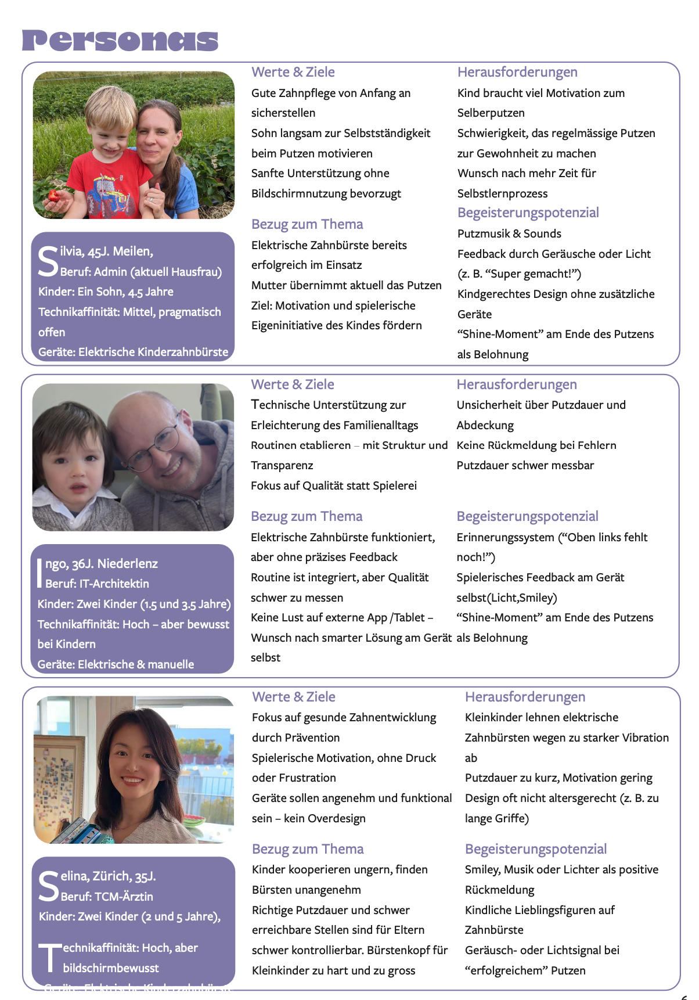

--

##Intro

ZahniHero is an interactive toothbrushing assistant designed specifically for children, to motivate them to brush their teeth for up to 3 minutes. As soon as brushing begins, ZahniHero uses sound or vibration sensors to detect activity and activates colorful LED animations: blue after 1 minute, flashing white after 2 minutes, and a rainbow light after 3 minutes. The goal is to make brushing fun and to encourage healthy, consistent habits.

In addition to the physical device, the companion website https://zahnihero.yiyun.me/ offers a digital extension. Here, parents and dentists can view brushing history and duration through visual dashboards, providing additional guidance. The site is connected to our Supabase database, which collects real-time brushing data from each device.

ZahniHero – for better brushing routines, powered by play and supported by data — without screens. Unlike other products on the market that rely on an additional tablet to entertain children during brushing, ZahniHero keeps the experience simple, focused, and engaging.

--

## Table of Contents

- [Idea](#idea)
- [Short Project Video](#short-project-video)  
- [Approach](#approach)  
- [Challenges and Lessons Learned](#challenges-and-lessons-learned)  
- [Technology](#technology)  
- [UX](#ux)  
- [Known Bugs](#known-bugs)  
- [Task Distribution](#task-distribution)  

---

## Idea

Almost all kids lack the patience to brush their teeth for the full 3 minutes.
I wanted to make toothbrushing more fun and effective for my daughter — and for other children — without relying on screens.
ZahniHero replaces tablets and cartoons with playful light signals, encouraging longer and healthier brushing.
The more advanced idea is to make the toothbrush interact with kids through stories, music, and riddles.

---
## Short Project Video

The video is presented in 3 parts:

Part 1: Touch sensor with LED light

Part 2: Sound sensor with data transmission

Part 3: Data is wireless uploaded to Supabase in real time

Unfortunately, I originally planned a fourth Video— a demonstration of the sound sensor and LED integrated directly into the toothbrush. 
However, due to the lack of 3D printing tools and a broken LED pin during assembly, I wasn’t able to complete this final version.

---

## Approach

I combined hardware (ESP32-C6, I2S sound sensors, and LEDs) with a Supabase-powered database and a simple web interface.
The development focused on delivering clear feedback, minimizing distractions, and providing parental insight.

Originally, I planned to use the SW-420 vibration sensor (first row, left). However, during testing, the sensor couldn’t reliably distinguish between tooth brushing and non-brushing activity — the output values ranged unpredictably from 100 to 1000.

So I tried two other vibration sensors: the ADXL335 (first row, middle) and a piezoelectric sensor (first row, right), as well as the I2S sound sensor (second row). Among the two vibration sensors, the ADXL335 gave relatively satisfactory results. Although the values were still a bit unstable, the difference between brushing and not brushing was noticeably larger. Tested picture below.

However, in discussion with Jan, he preferred that I test the I2S sound sensor — which I eventually chose to use in the final version.

---

## Challenges and Lessons Learned

- I had difficulties setting up the I2S sound sensor with the ESP32-C6. ChatGPT initially provided incorrect code and even concluded that the sensor and the chip were incompatible. With the help of the datasheet and a YouTube video, I was finally able to configure everything correctly.
[Dieses YouTube-Video war hilfreich bei der LCD-Verdrahtung](https://youtu.be/m8LwPNXqK9o)

- Designing a brushing detection algorithm based on vibration or sound patterns was challenging for two reasons. First, the vibration from brushing tends to fade and rise again every 10 seconds or so. Second, all the sensors produce fluctuating values, but I needed to detect continuous brushing, not short interruptions. A brief drop in sensor values shouldn't be interpreted as the user having stopped brushing.
So, I defined the brushing logic as follows:

Brushing is detected based on the I2S sound sensor value exceeding 100 or dropping below -100.

Sound is sampled every 100 milliseconds.

Every second, the system checks if there were at least 3 active readings (i.e., brushing activity).

This one-second brushing status is saved into a 5-second rolling window.

If at least 3 out of the last 5 seconds were brushing-active, the system considers the user to be currently brushing.

- During the process of uploading toothbrush data to Supabase and displaying it on a website, I encountered issues where the data wouldn’t appear. ChatGPT’s debugging suggestions were not always correct — I realized it's important to critically assess AI suggestions and rely on my own judgment and testing as well.

---

## Technology

### Physisch
- ESP32 Dev Modul  
- I2S soundsensor
- LED 
- SW-420 vibrationsensor (für Tests) 
- ADXL335 vibrationsensor (für Tests)  
- Piezoelektrischer vibrationsensor  (für Tests)  

### Digital
- Arduino (C/C++)  
- Supabase (Datenbank & REST API)  
- HTML, CSS, JavaScript  
- Webserver 
- OTA (Over-the-Air Updates für Firmware)  

## Datenstruktur

-Ein Flussdiagramm wurde erstellt, um den Informationsfluss zu visualisieren.

## Finales Steckbrett

---

## UX

### UX from the Toothbrush

The UX design was informed by insights from user interviews.  
🔗 [Figma link to interview results](https://www.figma.com/design/wadJ1YZ3SQiw23xoVoVQCV/AppKonzeption?node-id=0-1&t=GbyrRmA4R8Lrk3HM-1)

As a parent myself, I understand that kids respond better to lights and color changes.  
LED feedback is more engaging and motivating for them than a voice simply saying "one minute", "two minutes", or "finished".

---

### UX from the Web Interface

- Parents appreciate clear and simple visual summaries.
- The web interface is designed to be intuitive and easy to understand.

  

---

## Known Bugs

-The sensitivity of the sensors is relatively low, and the brushing detection algorithm still needs improvement.
-A final test could not be conducted with both the sound sensor and LED securely mounted on the toothbrush and protected with a waterproof casing.
  

---

## Task Distribution
The entire project was independently developed and implemented by Yiyun Lin.

